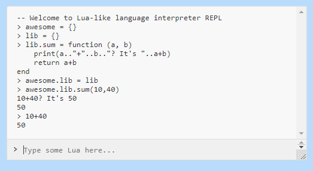

# Seiran

🚀🌙 Simple lua-like language interpreter built using antlr4

[Online REPL (hosted on Github pages)](https://kotborealis.github.io/seiran/)

## Implemented

* Statements:
    * global/local variables
    * global/local functions
    * function call
    * break
    * while - do
    * if - then - else - if - end
    * for - do - end
* Expressions:
    * nil, true, false
    * number
    * string
    * function expression (lambda)
    * tableconstruct
    * power operator
    * unary operators
    * mul/div operators
    * add/sub operators
    * comparison operators
    * and/or operators